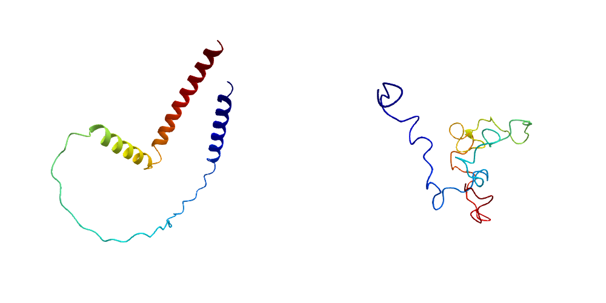

# DihedralParametrization

<!--
[](https://HolyLab.github.io/DihedralParametrization.jl/stable/)
[](https://HolyLab.github.io/DihedralParametrization.jl/dev/)
-->
[](https://github.com/HolyLab/DihedralParametrization.jl/actions/workflows/CI.yml?query=branch%3Amain)
[](https://codecov.io/gh/HolyLab/DihedralParametrization.jl)

DihedralParametrization builds models of [protein structure](https://en.wikipedia.org/wiki/Protein_structure) parametrized by their primary form of conformational flexibility: the ability of certain bonds to rotate.
Each rotatable bond's configuration is specified by a single number, the [dihedral angle](https://en.wikipedia.org/wiki/Dihedral_angle#In_stereochemistry), also sometimes called the torsion angle.
The most well-known angles are the backbone dihedrals `ϕ` and `ψ` often represented using [Ramachandran plots](https://en.wikipedia.org/wiki/Ramachandran_plot).
However, most amino acids also have one or more rotatable bonds in their side chains, specified by `χ` angles.
This package aims to offer a complete parametrization in terms of all rotatable bonds.

If you are only interested in the backbone degrees of freedom, see [Backboner](https://github.com/MurrellGroup/Backboner.jl) instead.


## Installation

DihedralParametrization is not (yet) registered. Therefore you should install it via

```
pkg> add https://github.com/HolyLab/DihedralParametrization.jl
```

## Pre-requisites

Someday, this package will likely permit the creation of "ideal" proteins from sequence alone, but for now the input must be a full structure as loaded by [BioStructures](https://github.com/BioJulia/BioStructures.jl) from a CIF or PDB file.
This structure must satisfy certain constraints:

- it should have hydrogens added using the Amber naming convention ([ChimeraX](https://www.cgl.ucsf.edu/chimerax/) works; many others might as well)
- Histidine should be diambiguated as
  [HID/HIE/HIP](https://ambermd.org/Questions/HIS.html), and the amino- and
  carboxyl-terminal residues should have "N" and "C" prepended to their residue
  names, respectively. BioStructure's `specializeresnames!(chain)` should
  suffice for this part (assuming you've already added hydrogens).

## Demo

The `test/data` folder of this package contains a fairly small protein structure with hydrogens added.
This structure was computed by [AlphaFold2](https://alphafold.com/); note that small proteins are often
stabilized by disulfide bonds, which represents a [challenge](https://pmc.ncbi.nlm.nih.gov/articles/PMC8712280/) for accurate structural prediction.
Thus the structure should only be taken as an illustration.

```julia
julia> using DihedralParametrization, BioStructures

julia> cd(joinpath(pkgdir(DihedralParametrization), "test", "data"))

julia> struc = read("AF-M3YHX5-F1-model_v4_hydrogens.cif", MMCIFFormat)
MolecularStructure AF-M3YHX5-F1-model_v4_hydrogens.cif with 1 models, 1 chains (A), 112 residues, 1833 atoms

julia> specializeresnames!(struc)
MolecularStructure AF-M3YHX5-F1-model_v4_hydrogens.cif with 1 models, 1 chains (A), 112 residues, 1833 atoms

julia> A = struc["A"]
Chain A with 112 residues, 0 other molecules, 1833 atoms

julia> A[1]    # check that we've renamed the amino-terminal residue
Residue 1:A with name NMET, 19 atoms

julia> bp, dihedrals = bondparametrization(A);

julia> bp
BondParametrization with 1833 atoms and 112 residues

julia> summary(dihedrals)
"562-element Vector{Float64}"
```

`bp` contains "fixed" data for the protein structure: details on bond lengths, bond angles, and the dihedral angles of non-rotatable bonds.
`dihedrals` is a vector containing the dihedral angles (in radians) for just the rotatable bonds, and represents the degrees of freedom in the protein structure.

The values in `dihedrals` represent the current state of the chain `A`,
but the key point is that you can specify a different vector (with entries ranging from -π to π) to generate a different configuration.
Let's recreate the protein with random dihedral angles:

```julia
julia> randdh = 2π * (rand(length(dihedrals)) .- 0.5);

julia> X = atomcoordinates(bp, randdh, A);

julia> summary(X)
"1833-element Vector{SVector{3, Float64}}"

julia> B = buildchain(A, bp, X)
Chain A with 112 residues, 0 other molecules, 1833 atoms
```

We can plot it like this:

```julia
using GLMakie, ProtPlot
fig = Figure(size=(1000, 500))
ax1 = LScene(fig[1, 1]; show_axis=false)
ax2 = LScene(fig[1, 2]; show_axis=false)
ribbon!(ax1, A)
ribbon!(ax2, B)
```

with result


