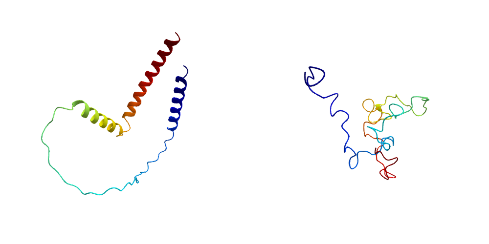

# DihedralParametrization

[](https://JuliaStructBio.github.io/DihedralParametrization.jl/stable/)
[](https://JuliaStructBio.github.io/DihedralParametrization.jl/dev/)
[](https://github.com/JuliaStructBio/DihedralParametrization.jl/actions/workflows/CI.yml?query=branch%3Amain)
[](https://codecov.io/gh/JuliaStructBio/DihedralParametrization.jl)
[](https://github.com/JuliaTesting/Aqua.jl)

DihedralParametrization represents [protein structures](https://en.wikipedia.org/wiki/Protein_structure)
using their rotatable-bond [dihedral angles](https://en.wikipedia.org/wiki/Dihedral_angle#In_stereochemistry).
These include the backbone angles `ϕ` and `ψ` and side-chain `χ` angles.

If you are only interested in the backbone degrees of freedom, see [Backboner](https://github.com/MurrellGroup/Backboner.jl) instead.

## Installation

```
pkg> add DihedralParametrization
```

## Demo

This demo takes an input structure and randomizes the dihedral angles, producing an unfolded protein:

```julia
julia> using DihedralParametrization, BioStructures

julia> struc = read("some_structure_with_hydrogens.cif", MMCIFFormat);

julia> specializeresnames!(struc);   # see the documentation's "Prerequisites" section

julia> bp, dihedrals = bondparametrization(struc["A"]);

julia> X = atomcoordinates(bp, dihedrals, struc["A"]);   # reconstructs the input coordinates

julia> randdh = 2π .* (rand(length(dihedrals)) .- 0.5);   # uniform in [-π, π)

julia> newchain = buildchain(struc["A"], bp, atomcoordinates(bp, randdh, struc["A"]));
```



See the [documentation](https://JuliaStructBio.github.io/DihedralParametrization.jl/stable/)
for input requirements, a complete example, and derivative functions.
